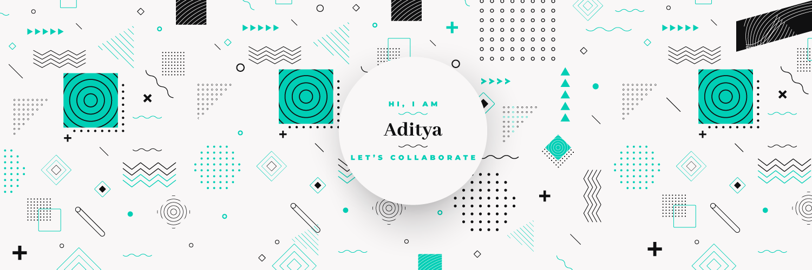

### Hello World! 

I’m Aditya, a Self-Taught Programmer,2nd year university CS student at [ITER, S.O.A.U.](https://www.soa.ac.in/iter), curious coder and an intermediate app developer. I make it my mission to know about every technology to some extent, I enjoy learning about new technologies,and i will be happy to collaborate.

- 🔭 I’m currently working on my DS&Algorithms and some minor projects.
- 🌱 I’m currently learning Kubernetes
- 👯 I’m looking to collaborate on a flutter project.
- 🤔 I’m looking for help with cloud.
- 💬 Ask me about Java,Flutter,Dart,C++ and web dev!
- 📫 How to reach me: `adityagup1a@gmail.com`
- 😄 Pronouns: he/him
- ⚡ Fun fact: You are reading this 

## ⚡ Technologies

### 📌 Pinned Repositories
<code>
<code>
  
<code>
  
